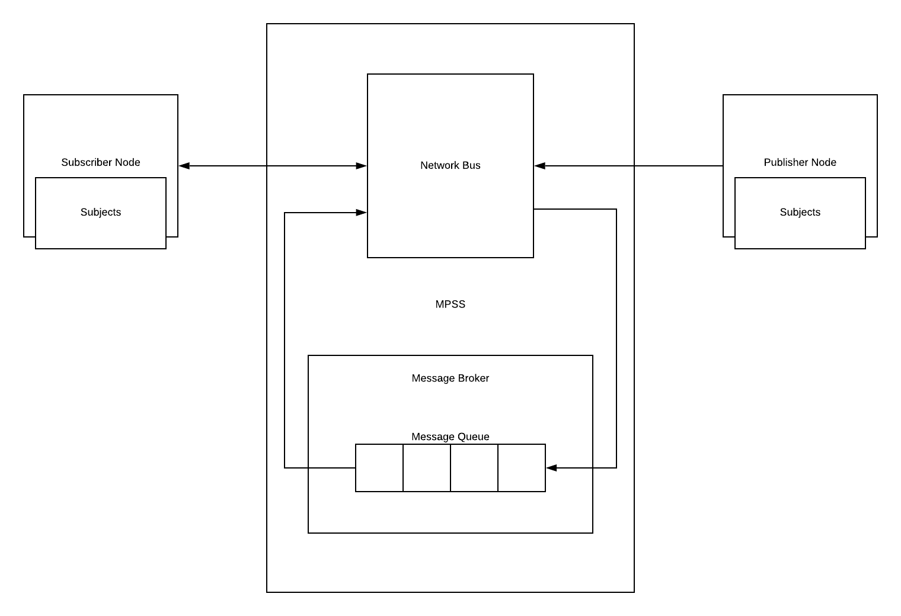

# Multi Publish Subscribe Service

__MPSS__ (Multi Publish Subscribe Service), is a service that can be used where a distributed architecture is in place.
A subscriber can subscribe to multiple subjects, and a publisher can likewise publish to various subjects.
This can be very useful in [multi agent](https://en.wikipedia.org/wiki/Multi-agent_system), and autonomous system.<br>
There are key features the make _MPSS_ stand out:

> - Ability to publish and subscribe to different subjects at the same time with the same node
> - No strict [Interface Description Language (IDL)](https://en.wikipedia.org/wiki/Interface_description_language) declaration. (Flexibility of data to be sent and received).
> - Data is passed around using [JSON](https://www.json.org/json-en.html).

## Software Architecture
<p align="center">
    
</p>

When a subscriber node registers its interest in a subject or multiple subjects, a message broker
is assigned to it which takes the necessary messages meant for the subscriber from the message queue based on
the subjects of interest. The publisher also has a message broker that puts its published messages on the 
queue with respect to the subjects it is publishing to. All communication are in [TCP](https://en.wikipedia.org/wiki/Transmission_Control_Protocol) and goes through the 
Network Bus.

### Registering Nodes

To register a node, a [JSON](https://www.json.org/json-en.html) message is sent. This message contains 
the node type i.e Subscriber or Publisher, the subjects being subscribed or published to, the time stamp
and the data when necessary.

> #### Subscribers
> To register as a subscriber, connect to the network bus (which is where ever the com.chidiebere.MPSService is running)<br>
and send a [JSON](https://www.json.org/json-en.html) message in this format.

````JSON
{
  "type" : "Subscriber",
  "subjects" : ["Subject1", "Subject2", "Subject3"],
  "_timeStamp" : 12345678987
}
````
> After the message has been sent and terminated with a 0 byte, stay connected to receive any message published
> on the subjects subscribed to.

> #### Publishers
> To register as a publisher, connect to the network bus (which is where ever the com.chidiebere.MPSService is running)<br>
and send a [JSON](https://www.json.org/json-en.html) message in this format.

````JSON
{
  "type" : "Publisher",
  "subjects" : ["Subject1", "Subject2", "Subject3"],
  "_timeStamp" : 12345678987,
  "data" : {
       "Subject1" : {
              "string" : "I am subject1",
              "int" : 1234
        },
       "Subject2" : {
              "string" : "I am subject2",
              "int" : 5678
        },
       "Subject3" : {
               "string" : "I am subject3",
               "list" : [1, 2, 3, 4]
       }
  }
}
````

##### Message Termination
> To indicate the end of a message, send a `0 byte` in other for the JSON to be parsed correctly.